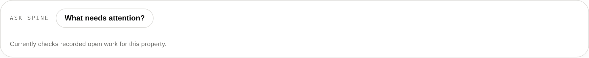
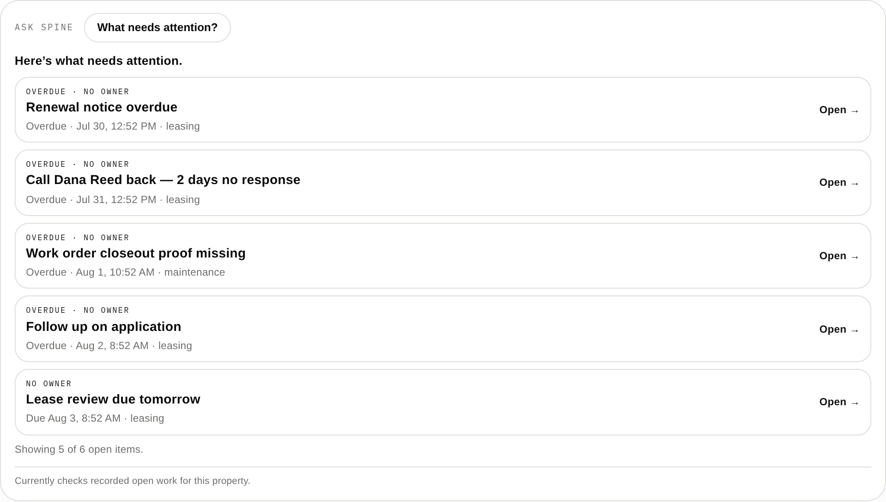
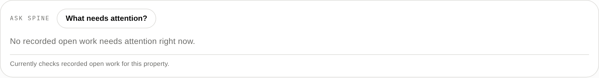
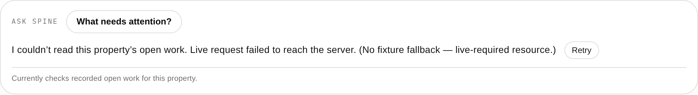
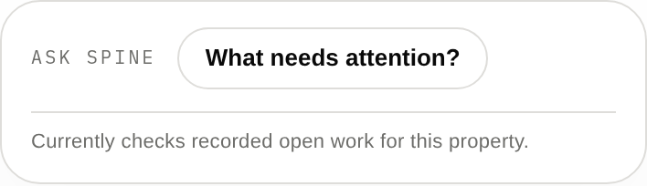
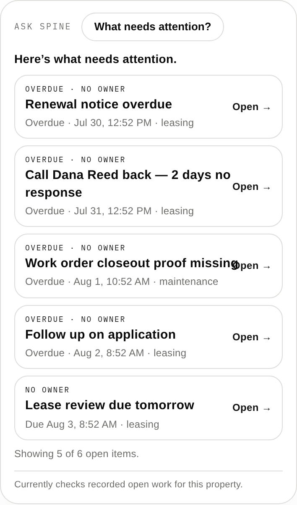
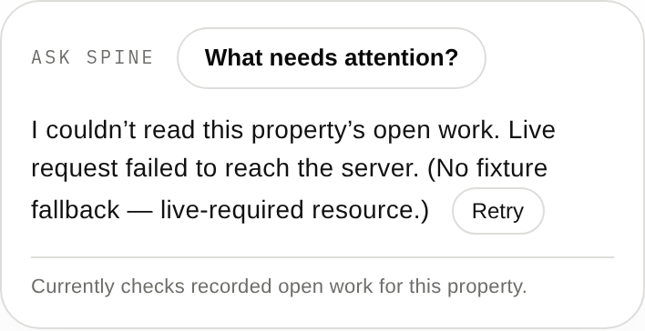

# Ask Spine Slice 1 — visual review set

Eight views for sign-off. **All captured from the real path**: real Chromium,
the real `index.html` artifact, real HTTPS to the app's own pinned origin, the
real API, and real Postgres. **No interception, no mocked loader, no fixtures.**

| # | View | File |
|---|---|---|
| 1 | Desktop — idle |  |
| 2 | Desktop — results |  |
| 3 | Empty (real empty database) |  |
| 4 | Unavailable (real API outage) |  |
| 5 | Unsupported question |  |
| 6 | Mobile — idle (390px) |  |
| 7 | Mobile — results (390px) |  |
| 8 | Mobile — unavailable (390px, real outage) |  |

## The design questions these are for

- Does Ask Spine stay **secondary to the property identity** but **primary as an
  operating shortcut**?
- Does it preserve the **four desks** rather than becoming a fifth?
- Does the persistent scope line feel **quiet**?
- Do results **collapse cleanly** when no longer needed?
- Can a busy employee understand the answer **in a few seconds**?
- Does mobile feel **intentional** rather than compressed?

## One capture note

View 5 (unsupported) is from the interception-based harness rather than the
API-backed one — the unsupported path is answered **entirely client-side and
issues no request at all**, so there is nothing for a live API to contribute to
it. Views 1–4 and 6–8 are all from the real API path.
