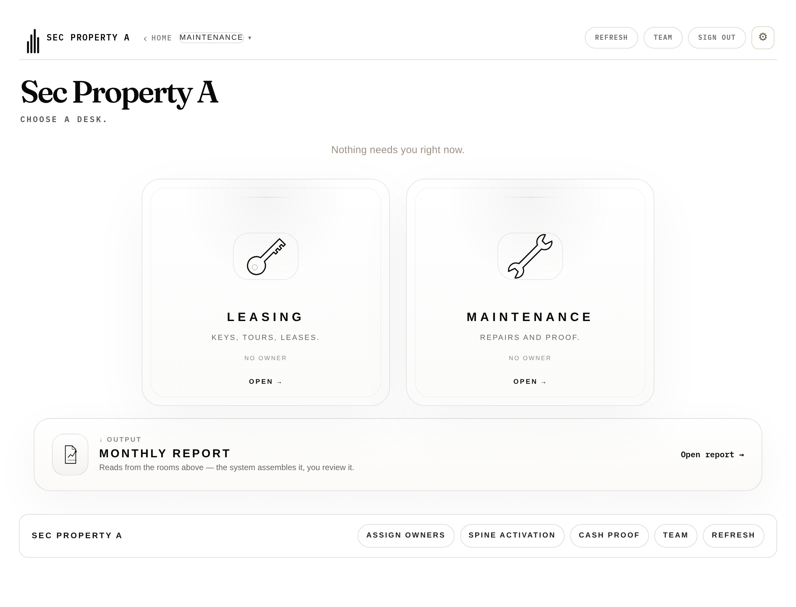

# Obligation authority boundary — browser acceptance evidence

**25 assertions, 0 failed, explicit floor 22.** Fail-closed: any failed
assertion throws and exits non-zero, and a run below the floor is rejected even
if nothing failed.

Real app branch · real API branch · isolated Postgres · canonical staff
sessions · real HTTPS to the app's pinned origin. **No interception on the
live path.**

## Screens exercised

| Screen | Assertion |
|---|---|
| Persona work queue (`renderMyWork`) | B11 |
| Management / open-work desk | B12 |
| Maintenance desk (third fan-out consumer) | B13 |
| Obligation drawer — claim | B14–B18b |
| Valid empty / unfiltered read | B18b |
| API unavailable | B24 |

## Network evidence — `network-evidence.json`

Every obligation request carries **`x-staff-session`** and **no
`x-operator-key`**, and sends **no `property_id`**. That is the whole point of
the lane, captured from the wire rather than asserted from source.

## Screenshots

| | |
|---|---|
| Collection results |  |
| After successful self-claim |  |
| Unavailable behaviour |  |

## Two defects the browser exposed — both fixed

1. **`writeAction` requires a declared `spec.key`.** The claim action omitted
   it, so the seam demanded `conversationId` and the call failed. Fixed by
   declaring `key: 'obligationId'` — the seam's own extension point, not a
   workaround.
2. **The app read the server receipt off the wrong level.** `writeAction`
   returns the loader envelope `{data, meta}`, so `d.receipt` was always
   undefined and silently fell back to a generic string. Now read from `.data`.

Neither was visible to source review, the HTTP proof, or the app suite. This is
what the browser rung is for.

## One behaviour worth stating, because it looks like a bug and is not

The open queue asks for `status=open`. Claiming flips the row to
`in_progress`, so the claimed item **leaves the open list** — the same
behaviour the legacy app had. Coherence is proven by it leaving (B18) plus an
unfiltered read showing the session user as owner (B18b).

## Running it

```bash
mkdir -p /tmp/pw && cd /tmp/pw && npm install playwright
# isolated Postgres + the API on :3001 + the app on :8081 + a TLS front for the
# pinned origin; seed with tools/ask_spine_e2e_seed.js's sibling seeder.
SP=/tmp/pw node obligations_security_browser_proof.browser.js
```

`.browser.js`, not `*.test.js`: `run_harnesses.sh` globs the latter and reads
exit codes, and this needs Playwright, Chromium and a running stack. **The
global runner is unchanged.**
