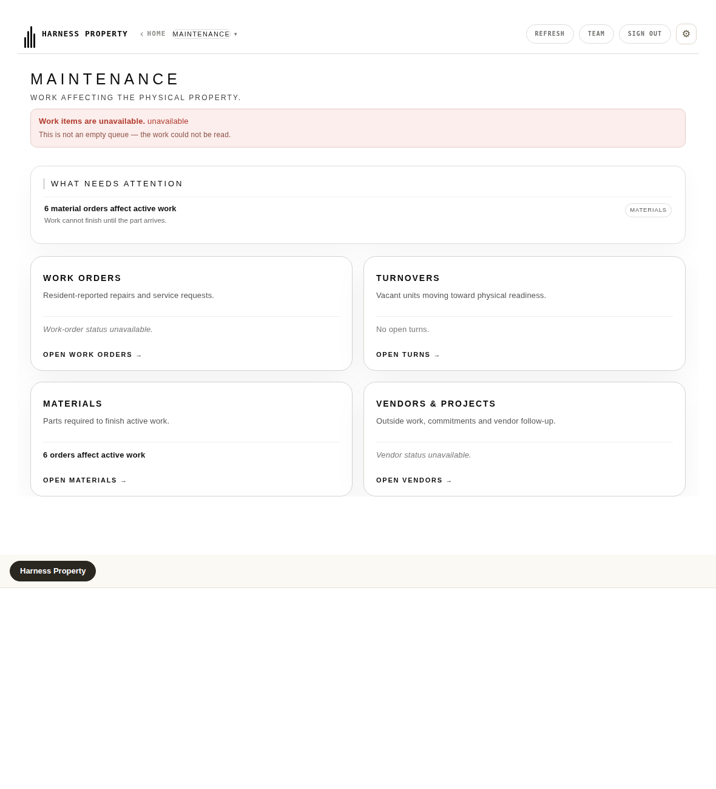
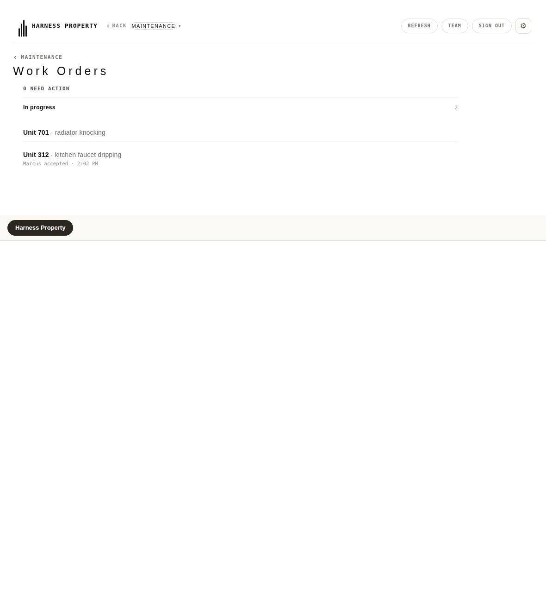

# Work Orders survives an obligations failure — browser acceptance evidence

**30 assertions, 0 failed.** Harness:
[`work_orders_reachable_when_obligations_fail.browser.js`](../../work_orders_reachable_when_obligations_fail.browser.js)

```bash
SP=/path/containing/node_modules/playwright \
  node work_orders_reachable_when_obligations_fail.browser.js
```

## The defect

A failed `/operator/obligations` read made the **live work-order door
unreachable**. `renderMaintenance()` called `deskObligationsUnavailable()`
and returned. Two consequences, both unintended:

1. `deskObligationsUnavailable()` replaces `#intelStrip` outright — and
   `#intelStrip` is the element carrying the four door tiles. The Work
   Orders tile was collateral damage of a banner about something else.
2. The `return` fired **before `lastMaintenance` was assigned**, so even a
   surviving tile would have hit `openMaintenanceModule()`'s `if(!st)` guard
   and toasted *"Open Maintenance first."*

The Work Orders door reads no obligation of any kind. The **route** to it
did. `maintenanceCounts()`, `maintenanceMainCounts()` and
`mhAttentionPanel()` read work, turn, supply and vendor sources only.

## The correction

An obligations failure now disables the obligation-composed lanes and
states itself on the desk. It does not remove the desk.

The other four composed desks (`renderLeasing`, `renderManagement`,
`renderReporting`, `renderCapital`) **keep** the whole-desk treatment:
obligations are folded into their payloads, so no pane there can be
salvaged truthfully. Maintenance is the one desk where that is not true.

## Two facts, two assertions

Honesty and reachability are separate claims and each needs its own proof.
The old bail satisfied the first by destroying the second.

| | |
|---|---|
| Desk survives, failure stated |  |
| Door reached by clicking the tile |  |

## The hole the proof found, that review did not

`body.maintenance-v6-mode .lanes{display:none!important}` — **the lanes are
hidden on the Maintenance desk.** The first version of this fix rendered the
honest unavailable state into those lanes and passed every lane assertion
while the operator saw a desk that looked perfectly healthy. A lost read
with no visible sign is precisely the confident-wrong this codebase refuses.

The notice now renders inside `#intelStrip`, above the doors, and it is
carried on `lastMaintenance` rather than painted once — `showMaintenanceMain()`
re-runs `renderMaintenanceSurface()` on every return from a sub-page, so a
one-shot notice would vanish on the first back-navigation.

**Presence is not visibility.** The assertion that catches this measures
`getComputedStyle().display` and a non-zero bounding box, not `querySelector`.

A second defect the recovery pass caught: `renderObligationsUnavailable()`
stamps `data-ps-state` on the element it replaces, and `renderRows()` never
cleared it — so a lane that recovered kept announcing an outage that had
ended. Fixed in `renderRows()`, where it covers every consumer.

## What makes this a proof and not a restatement

- **The failure is a real HTTP 503** from a real server, travelling through
  the app's own frozen `__psLive` loader. No page function is patched to
  simulate it. `loadObligations()` throws because the wire said 503.
- **The stub implements the API's server contract only** — the bare
  `{ property_id, count, work_orders }` that `src/maintenance/maintenance.js:651`
  actually returns, and the `/operator/me` grant from
  `src/identity/operator.js:235`. The `{ data, meta }` envelope is built by
  the real frozen loader in the page. Modelling a contract production never
  produces is the exact defect that let the original break through 99 green
  assertions; the stub is not allowed to be the thing that unwraps.
- **Navigation is real clicks.** The desk is opened by clicking the desk
  card; the door is opened by clicking the tile. A surface is not shipped
  until the proof enters it the way the operator enters it.
- **The door's own entry point is instrumented**, so "navigation reached it"
  is observed, not inferred from what ended up on screen.
- **A control case** proves a *successful* read is not over-corrected into a
  false unavailable, and that a recovered desk carries no stale notice.

## Falsification

Against a copied tree with the routing fix reverted, the harness goes red
and names the defect:

```text
node work_orders_reachable_when_obligations_fail.browser.js <copied-tree>

✗ THE WORK ORDERS TILE IS ON SCREEN after the obligations failure
✗ the other three tiles survived too — 0
✗ CLICKING THE TILE REACHES window.__psWorkOrders.open()
    — WORK ORDERS IS UNREACHABLE — no tile to click
exit 1
```

A missing tile is failed explicitly rather than allowed to time out and
kill the run: a harness whose death prints nothing reads like a clean stop,
which cost this release a full debug cycle once already.

## Bound on what this proves

This proves the **route**. It does not re-prove the door's data path —
that is `work_lifecycle_browser_proof.browser.js` (144 assertions, real
Postgres, real HTTP). The stub here exists to make the desk reachable and
the door's read succeed, not to stand in for that harness.

It is also **not** a production verification. It runs against the working
tree over a local origin. Nothing here says anything about what is deployed.
